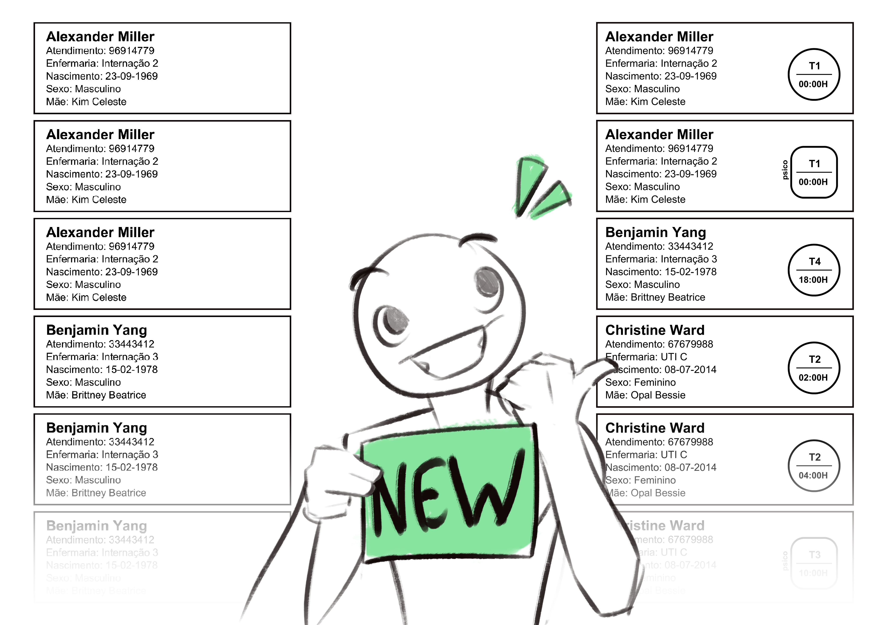

# Gerador de Etiquetas Inteligentes para Hospitais

## Descrição

Este script em Python foi desenvolvido para substituir o modelo atual de geração de etiquetas em hospitais, que usa um número fixo de etiquetas (por exemplo, 10, 12, 14... etiquetas por paciente). Esse método pode resultar em desperdício de material se o paciente precisar de pouca medicação ou, ao contrário, pode exigir a impressão de mais etiquetas. Minha ferramenta analisa os prontuários e gera etiquetas personalizadas, considerando horários, turnos e classes de medicamentos, otimizando a quantidade de etiquetas impressas de acordo com a necessidade de cada paciente.

# Funcionalidades e Filtros

- **Análise de Prontuários:** Lê os prontuários dos pacientes para determinar a quantidade essencial de etiquetas.

- **Classificação:** Organiza as etiquetas de acordo com os horários, tipos de medicamentos (normais ou psicotrópicos) e turnos.

- **Personalização:** Permite que o usuário determine intervalos de tempo a serem considerados na análise e, se necessário, desconsidere medicamentos específicos.

A ideia central é que esta ferramenta seja integrada ao sistema hospitalar já utilizado, usando a interface gráfica que o usuário já conhece. Após coletar todas as especificações que o usuário fizer, o script analisa o banco de dados e retorna com precisão a quantidade de etiquetas necessária por paciente. Além disso, também foi incluído um ***selo*** que retorna informações adicionais e variáveis em cada etiqueta, como o horário de manipulação do medicamento, a classe e o turno.

Filtrando por turnos pré-definidos:

Filtrando por horário especifico:
 
<!--GIF Coleta-->

## Requisitos

- Python 3.12.3
- Bibliotecas: pandas, numpy, reportlab, webbrowser, streamlit.

# Contribuição
Sinta-se à vontade para contribuir com melhorias. Faça um fork do projeto, crie uma nova branch e envie um pull request.

# Licença

Este arquivo está licenciado sob a CC BY-NC-SA 4.0. Veja o arquivo [LINCENSEmd](LICENSE.md) para mais detalhes.